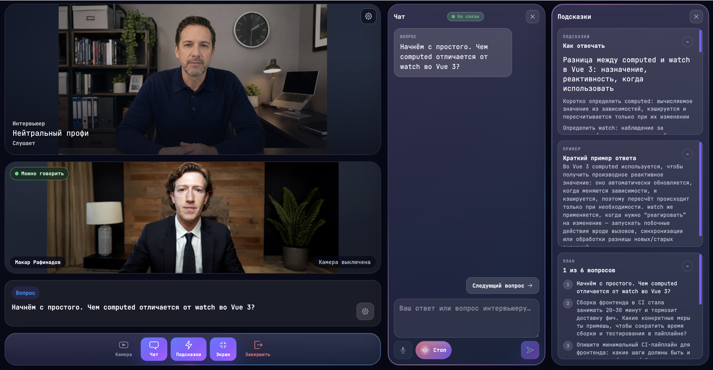

# Glasno

AI-powered interview practice platform built with Nuxt, Vue, and TypeScript.

[Live product](https://glasno.app)



## Product

Glasno helps people prepare for job interviews through realistic practice sessions tailored to a role, job description, and personal context.

The interview workspace brings together a simulated interview scene, conversation flow, contextual hints, and a structured interview plan in one interface.

## Main Capabilities

- Configurable interview sessions for a chosen role and context
- Interview workspace with chat, interview plan, answer input, and controls
- Contextual hints that support answers without replacing them
- Session reports and interview history
- Question library and configurable practice flows

## Stack

- **Frontend:** Nuxt 4, Vue 3, TypeScript, Pinia, Tailwind CSS, shadcn-vue
- **Backend:** Nitro, Drizzle ORM, PostgreSQL, Redis, BullMQ
- **Quality:** Vitest, ESLint, Zod, Docker

## Architecture

The application is organised as a full-stack Nuxt codebase:

```text
app/                    Vue application: pages, components, stores, and composables
server/api/             Thin HTTP handlers
server/application/     Use cases and business logic
server/domain/          Domain models and rules
server/infrastructure/  Database, Redis, queues, and external providers
server/interface/       Ports and integration contracts
shared/dto/             Shared Zod validation schemas
```
```
